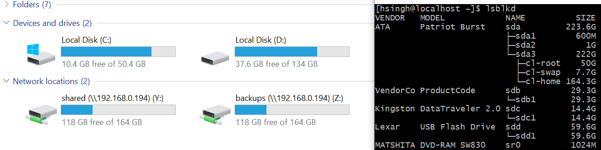

# quick-bench
Do a quick read/write benchmark using tool 'dd' from 'bash' terminal with these small scripts. 
It tries to benchmark using byte-sector-value of 1M or 1MegaBytes for the 'dd' tool, and gathers results for a 5 second run.
The benchmark results should be close to the results you would get when transferring files almost sequentially.
<br>
Note that caching at many levels may significantly disturb read benchmarks when reading files.
<br>
With these scripts, you can quickly test a device to have expected behaviour. 
For e.g, does a device using usb 3 port show higher speeds compared to when using usb 2 if it is rated for usb 3 speeds.
<br>

## Installation

### For linux:
* Download script files dd-bench-read and dd-bench-write
* <code>chmod +x dd-bench-read</code>
* <code>chmod +x dd-bench-write</code>
* <code>mkdir -p ~/.local/bin</code>
* Move both scripts to ~/.local/bin
* Ensure that ~/.local/bin is in $PATH

### For Windows:
* Install GitBash
## Scripts Syntaxes

### dd-bench-read

 Syntax 1
 sudo command device
 Example
 <code>sudo dd-bench-read /dev/mydevice</code>

 Syntax 2
 command file/to/read
 Example
 <code>dd-bench-read /home/mybigtestfile</code>
 
### dd-bench-write
 Syntax
 command [directory]

 Examples
 * <code>dd-bench-write</code>
 * <code>dd-bench-write ~/</code>
 * <code>dd-bench-write /mnt/mydir</code>

## Real Examples
Consider the following devices on Windows 10 and Linux
 
 
 ### dd-bench-read
 #### Using CentOS Linux
 ```
 [hsingh@localhost ~]$ sudo ./dd-bench-read /dev/sda
Benchmarking '/dev/sda'

Running dd with byte sector value 1MB
1028653056 bytes (1.0 GB, 981 MiB) copied, 4 s, 257 MB/s

Finished!
[hsingh@localhost ~]$ sudo ./dd-bench-read /dev/sdb
Benchmarking '/dev/sdb'

Running dd with byte sector value 1MB
73400320 bytes (73 MB, 70 MiB) copied, 4 s, 18.3 MB/s

Finished!
[hsingh@localhost ~]$ sudo ./dd-bench-read /dev/sdc
Benchmarking '/dev/sdc'

Running dd with byte sector value 1MB
101711872 bytes (102 MB, 97 MiB) copied, 4 s, 25.2 MB/s

Finished!
[hsingh@localhost ~]$ sudo ./dd-bench-read /dev/sdd
Benchmarking '/dev/sdd'

Running dd with byte sector value 1MB
568328192 bytes (568 MB, 542 MiB) copied, 4 s, 142 MB/s

Finished!
```

#### Using Gitbash in Windows 10
```
$ ./dd-bench-read /y/Iso/ubuntu-16.04.5-desktop-i386.iso
Benchmarking '/y/Iso/ubuntu-16.04.5-desktop-i386.iso'

Running dd with byte sector value 1MB
137363456 bytes (137 MB, 131 MiB) copied, 4 s, 33.8 MB/s

Finished!
```

 ### dd-bench-write
 #### Using CentOS Linux
 ```
 [hsingh@localhost ~]$ dd-bench-write
Benchmarking in '/tmp'

Running dd with byte sector value 1MB
1125122048 bytes (1.1 GB, 1.0 GiB) copied, 4 s, 281 MB/s

Finished!
[hsingh@localhost ~]$ dd-bench-write /mnt/generic32gb/
Benchmarking in '/mnt/generic32gb/'

Running dd with byte sector value 1MB
22020096 bytes (22 MB, 21 MiB) copied, 4 s, 5.5 MB/s

Finished!
[hsingh@localhost ~]$ dd-bench-write /mnt/dt16gb/
Benchmarking in '/mnt/dt16gb/'

Running dd with byte sector value 1MB
20971520 bytes (21 MB, 20 MiB) copied, 4 s, 5.2 MB/s

Finished!
[hsingh@localhost ~]$ dd-bench-write /mnt/lexar64gb/
Benchmarking in '/mnt/lexar64gb/'

Running dd with byte sector value 1MB
48234496 bytes (48 MB, 46 MiB) copied, 2 s, 19.7 MB/s

Finished!
 ```
 
#### Using GitBash in Windows 10
```
$ ./dd-bench-write
Benchmarking in '/tmp'

Running dd with byte sector value 1MB
1520435200 bytes (1.5 GB, 1.4 GiB) copied, 5 s, 304 MB/s

Finished!

$ ./dd-bench-write /y/
Benchmarking in '/y/'

Running dd with byte sector value 1MB
100663296 bytes (101 MB, 96 MiB) copied, 4 s, 25.1 MB/s

Finished!
```
